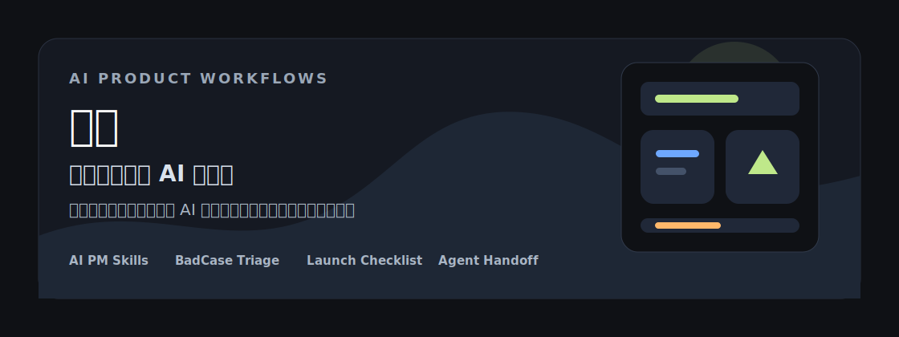
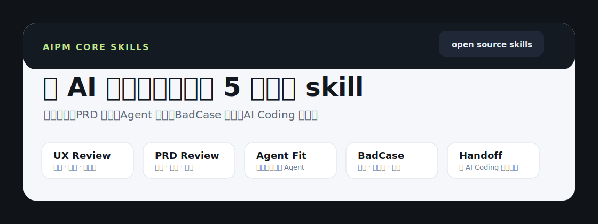
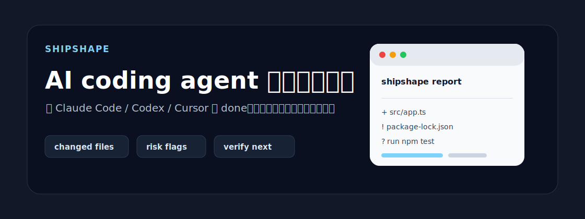
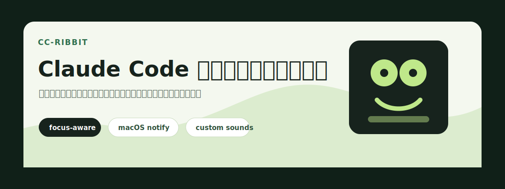
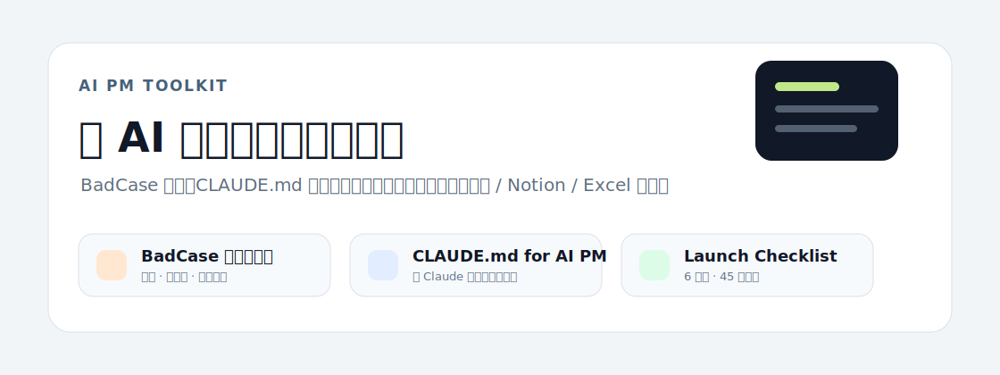

# 小卷

产设研一体的 AI 产品人，关注 AI 产品从想法到落地的完整链路：需求判断、用户体验、模型能力边界、BadCase 诊断、上线检查，以及如何把这些判断交接给 Claude Code / Codex / Cursor 继续执行。

我正在把 AI PM 的工作方法沉淀成一组开源工具、skills 和模板，让产品判断不只停留在 prompt，而是变成可复用、可检查、可交接的 workflow。

---

## 我在做的事

### [AIPM Core Skills](https://github.com/wgjuan2314/aipm-core-skills) — 把 AI 产品经理的判断力变成可运行的本地 skills

一套面向 AI 产品经理、AI 体验设计师和 AI Coding 实践者的 skill 项目。不是“大而全”的提示词库，而是把高频工作沉淀成 5 个可复用能力：AI 产品体验审查、AI PRD 审查、Agent 适用性判断、BadCase 诊断、AI Coding 任务交接。

### [Shipshape](https://github.com/wgjuan2314/shipshape) — AI coding agent 的交接检查器

Claude Code、Codex、Cursor 说 done 之后，Shipshape 帮你快速看一眼本地工作区：改了哪些文件、有没有风险区域、项目里有哪些验证命令、下一步应该检查什么。它不替代测试和 review，而是把“我觉得做完了”变成一份更清楚的交接报告。

### [cc-ribbit](https://github.com/wgjuan2314/cc-ribbit) — Claude Code 等待/完成提醒插件

给 Claude Code 加一层轻量提醒：等待确认、任务完成、切到别的窗口时，用声音和系统通知把你叫回来。适合长任务、频繁上下文切换、以及不想一直盯着终端的人。

---

## AI PM 开源资源

这些是我把 AI 产品工作里容易反复踩坑的部分整理成的模板。目标是让 AI PM、产品经理和体验设计师可以直接复制、改造、落地。

- [AI 产品 BadCase 诊断记录表](https://github.com/wgjuan2314/aipm-badcase-template)  
  面向产品决策的 BadCase 分诊工具，覆盖问题现场、归因层、修复动作、优先级和状态跟踪。

- [CLAUDE.md 最佳实践（AI PM 视角）](https://github.com/wgjuan2314/aipm-claude-md)  
  让 Claude Code 真正理解产品工作上下文，而不是只按工程模板回答。

- [AI 产品上线 Checklist](https://github.com/wgjuan2314/aipm-launch-checklist)  
  覆盖产品、AI 能力、体验、数据、安全、执行 6 大维度的上线前检查清单。

---

## 我相信的几件事

**AI 产品不是 prompt 的堆叠，而是系统性的产品判断。**  
模型边界、失败兜底、用户预期、评测标准和上线策略，应该在需求阶段就被写清楚。

**好的 AI PM 工作流要能交接。**  
如果一个判断只能存在于脑子里，它就很难被复用；如果能沉淀成 skill、模板或检查清单，它就可以被协作、验证和迭代。

**用户体验不是界面装饰，而是产品决策的一部分。**  
AI 功能是否可信、可控、可恢复，往往决定了用户是否愿意继续使用。

---

## 找到我

- GitHub: [@wgjuan2314](https://github.com/wgjuan2314)
- 手机 / 微信：15921177164
- 方向：AI PM / AI 产品体验 / AI Coding 工作流 / 产品方法论工具化
